## Convolutional Neural Networks {.flexbox .vcenter}

<div align='center'>
Now that each audio file has been converted into an image we can apply CNNs for **image classification** of the MFCCs.

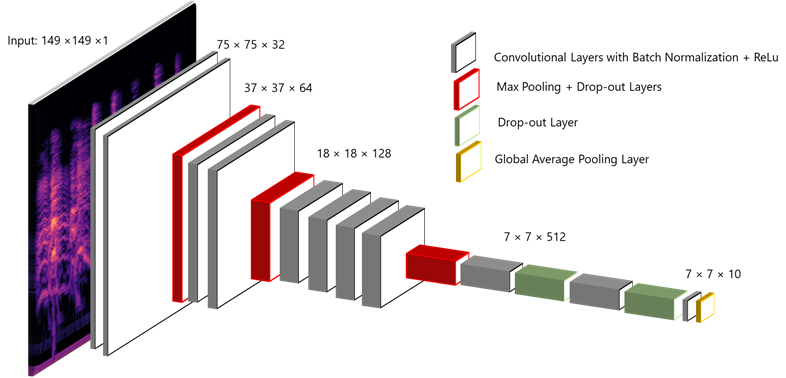
</div>


## Convolutional Neural Networks | Keras {.flexbox .vcenter .build}


To do that, we'll use `Keras`:a high-level python API which trains convolutional neural networks working on `Tensorflow` as back-end. 

It allows us to quickly build a CNN with minimal lines of code and is based on a **sequential structure of layers**. 

<!-- Let's look at the syntax of the different types of hidden layers in Keras and briefly explain their meaning, by building a simple model on our spectrograms. -->

<br>

**Data shape**: Each audio data has been shaped as a $32\times 32$ dimensional matrix with a single channel.

The first layer of the sequential model reads training data. So, we need to specify the size of images/training data that we are feeding the network, in our case as `input_shape = (32, 32, 1)`. 


<!-- layers spiegati:
https://ujjwalkarn.me/2016/08/11/intuitive-explanation-convnets/ -->


## Convolutional Neural Networks | Convolution layer {.flexbox .vcenter .build}

The purpose of a **convolutional layer** is to extract features  by preserving the relationship between pixels in a small square of the input image. 


Since the same filter is applied all over the image to find the relevant features, this step makes the CNN **translation invariant**.

## Convolutional Neural Networks | Convolution layer {.flexbox .vcenter .build}

The following layer applies $32$ filters of size $2\times 2$, giving a $31\times31$ output with $32$ channels over every input image.
``` python
model = Sequential()
model.add(Conv2D(32, kernel_size=(2, 2), activation='relu', input_shape=(32, 32, 1)))
```

We can also notice the presence of an **activation function**, whose purpose is to increase non-linearity in the CNN. 

**ReLU** (Rectified Linear Unit) function
$$f(x)=max(0,x)$$
is the most used activation function, because it is more efficient than other ones, like **sigmoid** or **hyperbolic** tangent, due to the simplicity of its derivatives.
<!-- (being $0$ or $1$) -->

<!-- padding  e stride? -->

<!-- In this context a **neuron** is simply a set of inputs, weights and an activation function, giving a single output which can then be picked up as an input for another layer of neurons. -->

## Convolutional Neural Networks | Pooling layer {.flexbox .vcenter .build}

**Pooling layers** apply a downsampling function and output a smaller array containing only the most important image features in the context of **spatial invariance**: they enable the CNN to detect features for different angles and lighting conditions. Of course, they also reduce the *number of computations*.

``` python
model.add(MaxPooling2D(pool_size=(2, 2)))
```

For example this *max pooling* takes the maximum value in each $2\times2$ matrix block. 

Similarly, we could use on *average pooling* or a *sum pooling*.

<div align='center'>
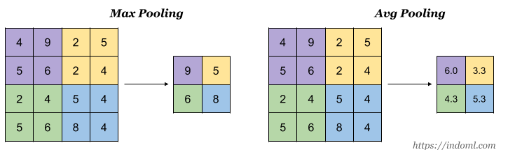
</div>


## Convolutional Neural Networks | Dropout layer {.flexbox .vcenter}

**Dropout** is a very simple *regularization tecnique* (prevents a neural network from overfitting): it randomly ignores some neurons in the hidden layers.

<div align='center'>
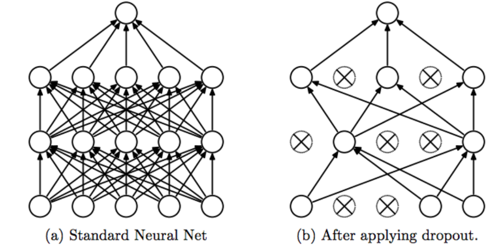
</div>

<!-- ### Full conncetion  -->

<!-- One of the main characteristics of CNNs is **local connectivity**: each neuron is connected only to a subset of the input image.  -->

<!-- cosa fa invece la full connection? -->

## Convolutional Neural Networks | Classification layer {.flexbox .vcenter .build}


In order to perform classification, our CNN needs a 1D feature vector, which is obtained by applying a **flattening** layer.

``` python
model.add(Flatten())
```

One of the main characteristics of CNNs is **local connectivity**: each neuron is connected only to a subset of the input image.
 
But in this last step our CNN needs to combine all the previously enhanced local features in order to perform classification. This is why the last layer of classification creates a **fully connected layer**:

``` python
model.add(Dense(35, activation='softmax'))
```

Here $35$ is the number of classes in our dataset and $softmax$ is the activation function, which outputs the desired probability distribution.
<!-- and almost acts as a **Max-layer** output, while being differentiable. -->


<!-- https://www.quora.com/Artificial-Neural-Networks-Why-do-we-use-softmax-function-for-output-layer -->

## Convolutional Neural Networks | Back-propagation {.flexbox .vcenter}


After building the architecture of the model, comes the important step of specifying the method for **back-propagation**, by choosing a loss function and an optimizer.

``` python
model.compile(loss=keras.losses.categorical_crossentropy,
              optimizer=keras.optimizers.Adadelta(),
              metrics=['accuracy'])
```

- The loss function used is the **categorical cross entropy**, which is widely used in classification problems.

- `Adadelta` is a particular optimizer which adapts learning rates relative to how frequently a parameter gets updated during training: the more updates a parameter receives, the smaller the updates.

<!-- parlare di batch e epochs -->

<!-- qua spiega function API e CNN noti, come vgg:
http://cv-tricks.com/tensorflow-tutorial/keras/ -->


## Convolutional Neural Networks | Testing {.flexbox .vcenter}

Now we're going to see accuracy and loss performances of some CNN models.

They all have been **trained on 63497 samples** and **validated on 42332 samples** in each epoch, with batches of size 100.

<!-- model 1 -->


## Convolutional Neural Networks | Multiple dropouts + 2 poolings {.flexbox .vcenter}

``` python

model = Sequential()

model.add(Conv2D(32, kernel_size=(2,2), activation='relu', input_shape=(32,32,1)))
model.add(Conv2D(48, kernel_size=(2,2), activation='relu'))
model.add(Conv2D(120, kernel_size=(2,2), activation='relu'))

model.add(MaxPooling2D(pool_size=(4, 4)))
model.add(MaxPooling2D(pool_size=(2, 2)))
model.add(Dropout(0.25))

model.add(Flatten())
model.add(Dense(128, activation='relu'))
model.add(Dropout(0.25))

model.add(Dense(64, activation='relu'))
model.add(Dropout(0.4))

model.add(Dense(35, activation='softmax'))
model.compile(loss=keras.losses.categorical_crossentropy,
              optimizer=keras.optimizers.Adadelta(), metrics=['accuracy'])

```

## Convolutional Neural Networks | Multiple dropouts + 2 poolings {.flexbox .vcenter}

<!-- questo ci ha messo circa 1 minuto per epoch... quindi -->

300s/epoch 

50 epochs

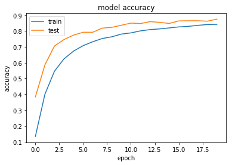
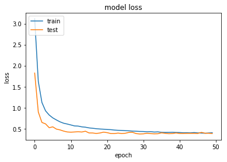

<!-- data augmentation for overfitting 
https://www.learnopencv.com/image-classification-using-convolutional-neural-networks-in-keras/-->

<!-- model 2 -->


<!-- model 4 -->
## Convolutional Neural Networks | Increasing convolutions + many dropouts {.flexbox .vcenter}

``` python

model = Sequential()

model.add(Conv2D(32, kernel_size=kernel_size, activation='relu', input_shape=input_shape))
model.add(Conv2D(64, kernel_size=kernel_size, activation='relu'))   
model.add(Dropout(0.25))
model.add(Conv2D(128, kernel_size=kernel_size, activation='relu'))    
model.add(Dropout(0.25))

model.add(MaxPooling2D(pool_size=(2,2)))
model.add(Dropout(0.25))
model.add(AveragePooling2D(pool_size=(2,2)))
model.add(Dropout(0.25))

model.add(Flatten())
model.add(Dense(128, activation='relu'))
model.add(Dropout(0.5))
model.add(Dense(35, activation='softmax'))

model.compile(loss=keras.losses.categorical_crossentropy,
              optimizer=keras.optimizers.Adadelta(), metrics=['accuracy'])

```


## Convolutional Neural Networks | Increasing convolutions + many dropouts {.flexbox .vcenter}

360s/epoch 10 epochs

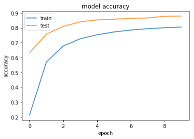
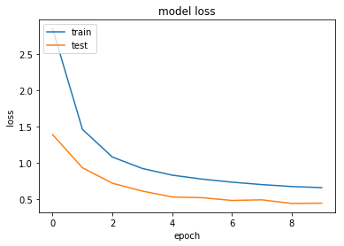


<!-- model 2 -->
## Convolutional Neural Networks | Repeated convolutions + 1 pooling {.flexbox .vcenter}

``` python

model = Sequential()

model.add(Conv2D(64, kernel_size=kernel_size, activation='relu', input_shape=input_shape))
model.add(Conv2D(64, kernel_size=kernel_size, activation='relu'))    

model.add(Conv2D(128, kernel_size=kernel_size, activation='relu'))    
model.add(Conv2D(128, kernel_size=kernel_size, activation='relu'))

model.add(MaxPooling2D(pool_size=(2,2)))

model.add(Flatten())
model.add(Dropout(0.5))
model.add(Dense(35, activation='softmax'))

model.compile(loss=keras.losses.categorical_crossentropy,
                  optimizer=keras.optimizers.Adadelta(),
                  metrics=['accuracy'])
                  
```

## Convolutional Neural Networks | Repeated convolutions + 1 pooling {.flexbox .vcenter}

700s/epoch

20 epochs

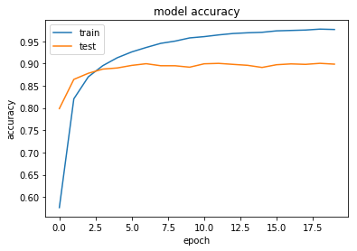
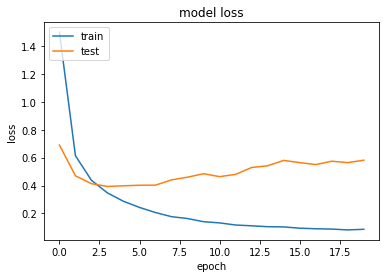


<!-- model 3 -->
## Convolutional Neural Networks | Increasing convolutions + 3 dropouts {.flexbox .vcenter}

``` python

model = Sequential()

model.add(Conv2D(32, kernel_size=kernel_size, activation='relu', input_shape=input_shape))
model.add(Conv2D(64, kernel_size=kernel_size, activation='relu'))    
model.add(Conv2D(128, kernel_size=kernel_size, activation='relu'))    
model.add(Conv2D(256, kernel_size=kernel_size, activation='relu'))    

model.add(MaxPooling2D(pool_size=(2,2)))
model.add(Dropout(0.5))

model.add(Flatten())
model.add(Dropout(0.5))
model.add(Dense(128, activation='relu'))
model.add(Dropout(0.5))
model.add(Dense(35, activation='softmax'))

model.compile(loss=keras.losses.categorical_crossentropy,
              optimizer=keras.optimizers.Adadelta(),
                  metrics=['accuracy'])

```

## Convolutional Neural Networks | Increasing convolutions + 3 dropouts {.flexbox .vcenter}

900s/epoch

10 epochs

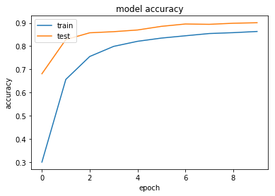
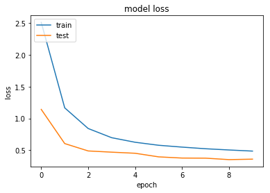


