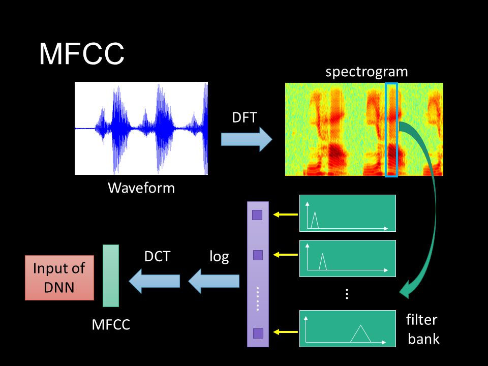
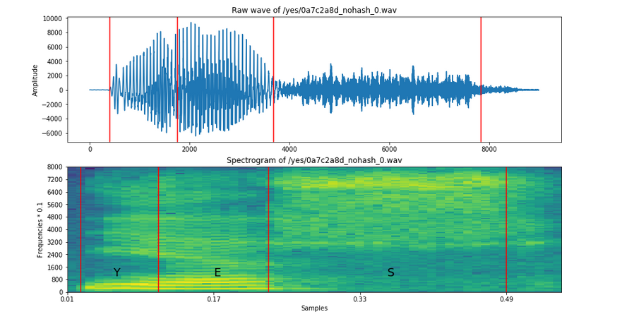
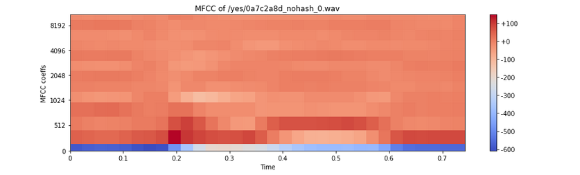
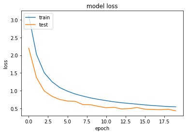
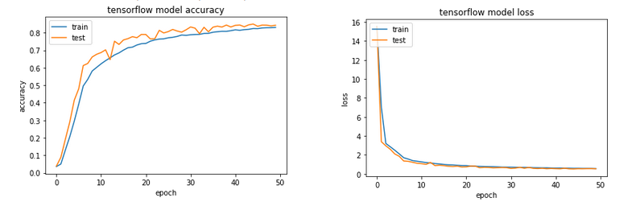
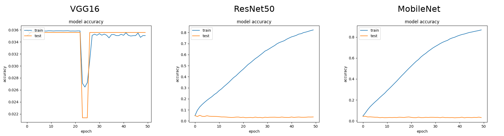
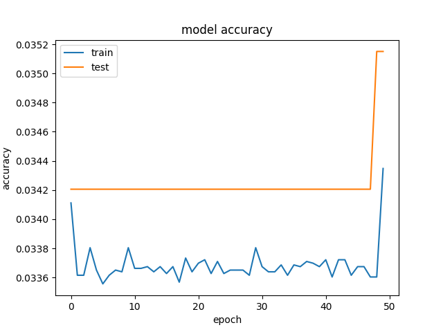

## Deep learning for speech recognition, an overview

- There are a lot of different architectures used for speech recognition:

- Recurrent Neural Network (RNN)
- Restricted Boltzmann Machines(RBM)
- Deep Belief Network(DBN)
- Deep Convex Nets(DCN)
- Deep Neural Networks(DNN)
- Deep AutoEncoder
- Deep Stacking Network(DSN)
- Convolutional Neural Network(CNN)

- We used Convolutional Neural Networks because based on Kaggle competitions results they looked promising.

## CNN's for speech recognition


<div align="center">

</div>

So there are two crucial steps: extracting the features and building che convnet.


## Types of possible features useful for CNNs:{.build}

- Time domain : raw audio data (intensity vs time)
- Frequency domain : spectrogram
- MFCC : Mel frequency Cepstral coefficients


## MFCC's computation steps{.build}

- Divide the signal in uniformly spaced windows (30ms each)
- Compute the power spectrum of each interval
- Apply the mel filterbank to the power spectrum (mimics human cochlea).
The spacing is narrower for low frequencies and wider for high ones.
- Take the logarithm (we are not linear listeners)
- Compute the Discrete cosine transform to decorrelate the filterbanks

- Why it's useful? Because we pass from a 16000 elements of a 16KHz sampled 1 sec length signal to a 32*32 array!

## A more intuitive view

<div align="center">


</div>


##Python translation of all this:


```{r, engine='python', echo = TRUE,eval=FALSE}

import librosa

wave = librosa.load("file_audio_path", mono=True, sr=None)
mfcc = librosa.feature.mfcc(wave, sr=16000)


```
- Librosa is a python package for music and audio analysis, the used function is build upon Scipy for the FFT computation.

- We repeated this operation for every file and saved the results as numpy arrays.


## The **Speech Commands Dataset**
The **Speech Commands Dataset** consists on 64000 audio files, of 1 second length, divided into 35 different classes.
The words are simple english words.
We used the version 0.0.2 of the dataset released in the 2018. It's a bigger and cleaner version of the 2017 one. 


<div align="center">


</div>

##An example of preprocessing from our dataset:


<div align="center">



</div>


## Convolutional Neural Networks {.flexbox .vcenter}

<div align='center'>
Now that each audio file has been converted into an bidimensional array we can apply CNNs for **image classification** of the MFCCs.


</div>


## Convolutional Neural Networks | Keras {.flexbox .vcenter .build}


To do that, we'll use `Keras`:a high-level python API which trains convolutional neural networks working on `Tensorflow` as back-end. 

It allows us to quickly build a CNN with minimal lines of code and is based on a **sequential structure of layers**. 

<!-- Let's look at the syntax of the different types of hidden layers in Keras and briefly explain their meaning, by building a simple model on our spectrograms. -->

<br>

**Data shape**: Each audio data has been shaped as a $32\times 32$ dimensional matrix with a single channel.

The first layer of the sequential model reads training data. So, we need to specify the size of images/training data that we are feeding the network, in our case as `input_shape = (32, 32, 1)`. 


<!-- layers spiegati:
https://ujjwalkarn.me/2016/08/11/intuitive-explanation-convnets/ -->


## Convolutional Neural Networks | Convolution layer {.flexbox .vcenter .build}

The purpose of a **convolutional layer** is to extract features  by preserving the relationship between pixels in a small square of the input image. 


Since the same filter is applied all over the image to find the relevant features, this step makes the CNN **translation invariant**.

## Convolutional Neural Networks | Convolution layer {.flexbox .vcenter .build}

The following layer applies $32$ filters of size $2\times 2$, giving a $31\times31$ output with $32$ channels over every input image.
``` python
model = Sequential()
model.add(Conv2D(32, kernel_size=(2, 2), activation='relu', input_shape=(32, 32, 1)))
```

We can also notice the presence of an **activation function**, whose purpose is to increase non-linearity in the CNN. 

**ReLU** (Rectified Linear Unit) function
$$f(x)=max(0,x)$$
is the most used activation function, because it is more efficient than other ones, like **sigmoid** or **hyperbolic** tangent, due to the simplicity of its derivatives.
<!-- (being $0$ or $1$) -->

<!-- padding  e stride? -->

<!-- In this context a **neuron** is simply a set of inputs, weights and an activation function, giving a single output which can then be picked up as an input for another layer of neurons. -->

## Convolutional Neural Networks | Pooling layer {.flexbox .vcenter .build}

**Pooling layers** apply a downsampling function and output a smaller array containing only the most important image features in the context of **spatial invariance**: they enable the CNN to detect features for different angles and lighting conditions. Of course, they also reduce the *number of computations*.

``` python
model.add(MaxPooling2D(pool_size=(2, 2)))
```

For example this *max pooling* takes the maximum value in each $2\times2$ matrix block. 

Similarly, we could use on *average pooling* or a *sum pooling*.

<div align='center'>

</div>


## Convolutional Neural Networks | Dropout layer {.flexbox .vcenter}

**Dropout** is a very simple *regularization tecnique* (prevents a neural network from overfitting): it randomly ignores some neurons in the hidden layers.

<div align='center'>

</div>

<!-- ### Full conncetion  -->

<!-- One of the main characteristics of CNNs is **local connectivity**: each neuron is connected only to a subset of the input image.  -->

<!-- cosa fa invece la full connection? -->

## Convolutional Neural Networks | Classification layer {.flexbox .vcenter .build}


In order to perform classification, our CNN needs a 1D feature vector, which is obtained by applying a **flattening** layer.

``` python
model.add(Flatten())
```

One of the main characteristics of CNNs is **local connectivity**: each neuron is connected only to a subset of the input image.
 
But in this last step our CNN needs to combine all the previously enhanced local features in order to perform classification. This is why the last layer of classification creates a **fully connected layer**:

``` python
model.add(Dense(35, activation='softmax'))
```

Here $35$ is the number of classes in our dataset and $softmax$ is the activation function, which outputs the desired probability distribution.
<!-- and almost acts as a **Max-layer** output, while being differentiable. -->


<!-- https://www.quora.com/Artificial-Neural-Networks-Why-do-we-use-softmax-function-for-output-layer -->

## Convolutional Neural Networks | Back-propagation {.flexbox .vcenter}


After building the architecture of the model, comes the important step of specifying the method for **back-propagation**, by choosing a loss function and an optimizer.

``` python
model.compile(loss=keras.losses.categorical_crossentropy,
              optimizer=keras.optimizers.Adadelta(),
              metrics=['accuracy'])
```

- The loss function used is the **categorical cross entropy**, which is widely used in classification problems.

- `Adadelta` is a particular optimizer which adapts learning rates relative to how frequently a parameter gets updated during training: the more updates a parameter receives, the smaller the updates.

<!-- parlare di batch e epochs -->

<!-- qua spiega function API e CNN noti, come vgg:
http://cv-tricks.com/tensorflow-tutorial/keras/ -->


## Convolutional Neural Networks | Testing {.flexbox .vcenter}

Now we're going to see accuracy and loss performances of some CNN models.

They all have been **trained on 63497 samples** and **validated on 42332 samples** in each epoch, with batches of size 100.


## Convolutional Neural Networks | Increasing convolutions + many dropouts {.flexbox .vcenter}

``` python

model = Sequential()

model.add(Conv2D(32, kernel_size=kernel_size, activation='relu', input_shape=input_shape))
model.add(Conv2D(64, kernel_size=kernel_size, activation='relu'))   
model.add(Dropout(0.25))
model.add(Conv2D(128, kernel_size=kernel_size, activation='relu'))    
model.add(Dropout(0.25))

model.add(MaxPooling2D(pool_size=(2,2)))
model.add(Dropout(0.25))
model.add(AveragePooling2D(pool_size=(2,2)))
model.add(Dropout(0.25))

model.add(Flatten())
model.add(Dense(128, activation='relu'))
model.add(Dropout(0.5))
model.add(Dense(35, activation='softmax'))

model.compile(loss=keras.losses.categorical_crossentropy,
              optimizer=keras.optimizers.Adadelta(), metrics=['accuracy'])

```


## Convolutional Neural Networks | Increasing convolutions + many dropouts {.flexbox .vcenter}

360s/epoch - 10 epochs


<!-- model 2 -->


## Convolutional Neural Networks | Repeated convolutions + 1 pooling {.flexbox .vcenter}

``` python

model = Sequential()

model.add(Conv2D(64, kernel_size=kernel_size, activation='relu', input_shape=input_shape))
model.add(Conv2D(64, kernel_size=kernel_size, activation='relu'))    

model.add(Conv2D(128, kernel_size=kernel_size, activation='relu'))    
model.add(Conv2D(128, kernel_size=kernel_size, activation='relu'))

model.add(MaxPooling2D(pool_size=(2,2)))

model.add(Flatten())
model.add(Dropout(0.5))
model.add(Dense(35, activation='softmax'))

model.compile(loss=keras.losses.categorical_crossentropy,
                  optimizer=keras.optimizers.Adadelta(),
                  metrics=['accuracy'])
                  
```

## Convolutional Neural Networks | Repeated convolutions + 1 pooling {.flexbox .vcenter}

700s/epoch - 20 epochs


<!-- model 3 -->


## Convolutional Neural Networks | Increasing convolutions + 3 dropouts {.flexbox .vcenter}

``` python

model = Sequential()

model.add(Conv2D(32, kernel_size=kernel_size, activation='relu', input_shape=input_shape))
model.add(Conv2D(64, kernel_size=kernel_size, activation='relu'))    
model.add(Conv2D(128, kernel_size=kernel_size, activation='relu'))    
model.add(Conv2D(256, kernel_size=kernel_size, activation='relu'))    

model.add(MaxPooling2D(pool_size=(2,2)))
model.add(Dropout(0.5))

model.add(Flatten())
model.add(Dropout(0.5))
model.add(Dense(128, activation='relu'))
model.add(Dropout(0.5))
model.add(Dense(35, activation='softmax'))

model.compile(loss=keras.losses.categorical_crossentropy,
              optimizer=keras.optimizers.Adadelta(),
                  metrics=['accuracy'])

```

## Convolutional Neural Networks | Increasing convolutions + 3 dropouts {.flexbox .vcenter}

900s/epoch - 10 epochs


##Testing a model on unseen data | Multiple dropouts + 2 poolings + BatchNormalization {.flexbox .vcenter}

Train 31748, Validation 31749, Test 42332 

``` python

model = Sequential()
model.add(BatchNormalization())
model.add(Conv2D(32, kernel_size=(2,2), activation='relu', input_shape=(32,32,1)))
model.add(Conv2D(48, kernel_size=(2,2), activation='relu'))
model.add(Conv2D(120, kernel_size=(2,2), activation='relu'))

model.add(MaxPooling2D(pool_size=(4, 4)))
model.add(MaxPooling2D(pool_size=(2, 2)))
model.add(Dropout(0.25))

model.add(Flatten())
model.add(Dense(128, activation='relu'))
model.add(Dropout(0.25))
model.add(Dense(64, activation='relu'))
model.add(Dropout(0.4))

model.add(Dense(35, activation='softmax'))
model.compile(loss=keras.losses.categorical_crossentropy,
              optimizer=keras.optimizers.Adadelta(), metrics=['accuracy'])

```

##Testing a model on unseen data | Multiple dropouts + 2 poolings + BatchNormalization {.flexbox .vcenter}

<!-- questo ci ha messo circa 1 minuto per epoch... quindi -->

133s/epoch - 20 epochs




**Test loss**: 0.43
**Test accuracy**: 0.87

<!-- data augmentation for overfitting 
https://www.learnopencv.com/image-classification-using-convolutional-neural-networks-in-keras/-->


## Other trials | Mimicking the TensorFlow model{.build}

### The aim


Trying to reproduce TensorFlow's model is good:
 - as reference in comparing the obtained accuracy
 - to study the structure engineered by Google
 - to understand what appens under the hood of Keras

[Link to TensorFlow's article](https://www.tensorflow.org/tutorials/sequences/audio_recognition)


## Other trials | Mimicking the TensorFlow model{.build}

### The translation

``` python
  model = Sequential()

  model.add(Conv2D(64, (20, 8), activation='relu', input_shape=input_shape))
  model.add(Dropout(0.25))
  model.add(MaxPooling2D(pool_size=(2, 2)))

  model.add(Conv2D(64, (10, 4), activation='relu'))
  model.add(Dropout(0.25))
  model.add(MaxPooling2D(pool_size=(2, 2)))

  model.add(Flatten())
  model.add(Dense(n_output, activation='softmax'))

  model.compile(loss=keras.losses.categorical_crossentropy,
      optimizer=keras.optimizers.SGD(), metrics=['accuracy'])

```

## Other trials | Mimicking the TensorFlow model{.build}

## The result



Considering that in the reference article the accuracy on the test set is between 80% and 90%, we can state we succeeded in porting the TensorFlow model!

## Other trials | Operating with transfer learning{.build}

### The motivations

 - to explore this famous technique
 - to experiment other techniques
 - to bet among us


## Other trials | Operating with transfer learning{.build}

### The method

Used 3 network pre-trained on ImageNet:

- VGG16 (shallow but with lots of parameters)
- ResNet50 (deep network with less parameters)
- MobileNet (light network with "few" parameters)

We used MFCC to fine-tune them. 

## Other trials | Operating with transfer learning{.build}

### The structure

```
_________________________________________________________________
Layer (type)                 Output Shape              Param #   
=================================================================
conv2d_1 (Conv2D)            (None, 18, 9, 3)          84        
_________________________________________________________________
up_sampling2d_1 (UpSampling2 (None, 72, 36, 3)         0         
_________________________________________________________________
PRETRAINED NET (Model)       multiple                  ---  
_________________________________________________________________
flatten_1 (Flatten)          (None, 6144)              0         
_________________________________________________________________
dense_1 (Dense)              (None, 128)               786560    
_________________________________________________________________
dropout_1 (Dropout)          (None, 128)               0         
_________________________________________________________________
dense_2 (Dense)              (None, 36)                4644      
=================================================================
```


## Other trials | Operating with transfer learning{.build}

### The results

#### Spoiler alert: it didn't work




## Other trials | Working directly with spectrograms{.build}

### The goal

 - reduce the complexity of the preprocessing
 - let the network guess the best structure out of the almost raw material
 - keeping the solution easy

## Other trials | Working directly with spectrograms{.build}

### The result



Training the same clone of the TensorFlow's model it seems not to like the row spectrograms
